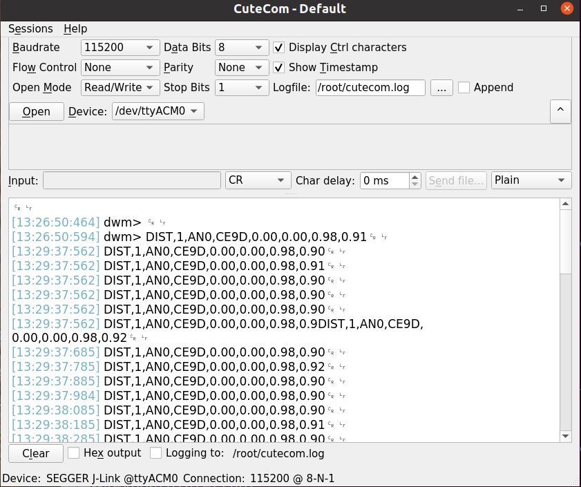

# uwb_localization_dwm
An implementation of UWB(Ultra-wideband) localization with DWM1001c.

## Information of platform

OS: `Ubuntu 20.04 LTS ` under `WSL2 (and Windows 11)` 

ROS: `noetic`

## Dependency
To build and run the package, the following dependencies should be included.
```
pip install pyserial
```

## Get Started

### UWB sensors setup
Follow the steps in [The MDEK1001 User Manual](https://www.qorvo.com/products/d/da007995) or [Decawave's DRTLS Guide](https://www.qorvo.com/products/d/da007996) to set up a UWB network with anchors and active tags using a [DRTLS application](https://www.qorvo.com/products/d/da007984) provided by [Decawave(Qorvo)](https://www.qorvo.com/products/p/MDEK1001#documents). Note that the DRTLS application is not necessary according to the MDEK1001 user manual, which means that you can set up the UWB sensor with a COM APP, such as Tera Term (and cutecom with CR mode if inputs are required).

### UWB sensors connection
If you are using Ubuntu directly or can connect the sensors already, you can skip this step.

```
# Install usbipd-win to connection USB ports in WSL2 (Run in Powershell)
winget install --interactive --exact dorssel.usbipd-win

# Install USBIP tools and hardware database (Run in WSL)
sudo apt install linux-tools-generic hwdata
sudo update-alternatives --install /usr/local/bin/usbip usbip /usr/lib/linux-tools/*-generic/usbip 20

# Connection USB port to Ubuntu (Run in Powershell)
usbipd wsl list
usbipd wsl attach --busid <busid>

# Reconnection USB port in Ubuntu (Run in WSL2)
sudo usbip attach -r $HOSTNAME.local -b <busip> # Run in WSL2 to reconnect <busip>.
```

## Test DWM1001-DEV
### Test UWB with a script
Run the demo to get UWB data from the active tag:

```
python3 get_uwb_data.py
```

### Test UWB with cutecom
You can also get the data with cutecom, if you have installed the cutecom in Ubuntu.
```
sudo apt update
sudo apt install cutecom

cutecom
```
Note that to get the data from cutecom, you must configure the UWB sensor following the user manual.
```
1. ...
8. Enter the command ‘nmt’ and press the return key twice which sets the tag into Active mode;
9. Enter ‘les’ to display the location estimates of the tag.
```
The output of UWB sensors (at least 1 active tag and 1 active anchor are required)


## Create ROS package
To download this source code
```
cd ~/catkin_ws/src
git clone https://github.com/LiuxhRobotAI/HR-robot-localization.git

# built
cd ~/catkin_ws
catkin_make
```

## Run ROS package for publishing tags' and anchors' information calculated by DRTLS for DWM1001C
Run the demo to publish the raw data with ROS.
```
roslaunch uwb_localization_dwm demo_pub_dis.launch
```
Or run with a specific port (USB port for UWB tag sensor, e.g. ttyACM0)
```
rosrun uwb_localization_dwm dwm1001_publish_distances.py _port:=/dev/ttyACM0 _tag_name:="tag0"
```

If everything goes well, you will get the following (an example) output.
```
[INFO] [1688393248.888293]: Anchor AN0:  x: 1.0 y: 0.0 z: 0.0
[INFO] [1688393248.889265]: Anchor AN1:  x: 0.0 y: 1.0 z: 0.0
[INFO] [1688393248.890024]: Anchor AN2:  x: 0.0 y: 0.0 z: 0.0
[INFO] [1688393248.890024]: Anchor AN3:  x: 0.0 y: 0.0 z: 1.0
[INFO] [1688393248.890642]: Tag tag:  x: 0.95 y: 0.92 z: 0.32
```

## Run ROS package for publishing tags' localization calculated by lsm and hrm with at least four anchors and one tag
Run the localization.launch to publish the positions of the tag.
```
roslaunch uwb_localization_dwm localization.launch
```
Or run with a specific port (USB port for UWB tag sensor)
```
rosrun uwb_localization_dwm uwb_localization.py _port:=/dev/ttyACM0 _tag_name:="tag0"
```

## Robot control
If you are using a `Jackal` robot to carry the tag and running a simulation [Jackal](http://docs.ros.org/en/latest-available/api/jackal_tutorials/html/simulation.html), you can use the following command to control the robot
```
rosrun uwb_localization_dwm jackal_teleop_key
```

## Calibration of two paths(Odometry)
The `simulation` variable in the main() of calibration.py is used to show a simulation of calibration. Set the `simulation` to False and input two paths to be calibrated. To show the result, please run
```
roslaunch uwb_localization_dwm calibration.launch
```

## Distance data saving and analyzing
The `save_bag_topic_dis.py`  can be used to analyze the statistical features of UWB distance measurements. Follow a `bag_name` to analyze a specific dataset. Example to run
```
python save_bag_topic_dis.py [bag_name] # Analyze the defaut dataset if no [bag_name].
```

## Path data saving and analyzing
The `plot_path_results.py` can be used to save and plot the paths of the robot using different methods. Right now, there are `HRM`, `LS`, `VI`, `VI-loop` and `LOAM` in some cases, maybe `VIU`, `LU`, `LIU` even `VILU` will be included shortly. Follow a `bag_name` to analyze a specific dataset. Example to run
```
python save_plot_path_results.py [bag_name] # Analyze the defaut dataset if no [bag_name].
```

## localization using stored distance data
The `uwb_fuhry_tihkionov.py` can be used to localize and get the paths of the robot using stored distance data with different methods. Right now, there are `HRM`, `LS` and `FTR`. Follow two string `bag_name_prefix height` to analyze a specific dataset. Example to run
```
python uwb_fuhry_tihkionov.py [bag_name_prefix height] # Analyze the defaut dataset if no [bag_name_prefix height].
```

## localization using stored distance data
The `path_result_analysis.py` can be used to analyze the performance of two methods. The paths of the robot stored different methods. Right now, there are `HRM`, `LS` and `FTR`. The reference is provided by a Lidar using an `A-LOAM` localization method, and the matched reference and estimation paths are aligned by Umeyama's method similar to the `evo``, an evaluation tool. Follow a `bag_name` to analyze a specific dataset. Example to run
```
python path_result_analysis.py [bag_name] # Analyze the defaut dataset if no [bag_name].
```

## ToDo
- [ ] Design controller to perform trajectory tracking control(using a new repo)

## Some references:
[The MDEK1001](https://www.qorvo.com/products/p/MDEK1001#documents) (a kits with 12 DWM1001-DEV development boards) resoures;

[The MDEK1001 User Manual](https://www.qorvo.com/products/d/da007995);

`https://github.com/20chix/dwm1001_ros`;

`https://github.com/TIERS/ros-dwm1001-uwb-localization`;

`https://github.com/ros/ros_tutorials/tree/ee5144f314e669cc6c85ea6e93b7da55d090a684/turtlesim/tutorials`;

`http://docs.ros.org/en/latest-available/api/jackal_tutorials/html/simulation.html`;

`https://github.com/L53317/A-modified-A-LOAM`; and

`https://github.com/MichaelGrupp/evo`.
